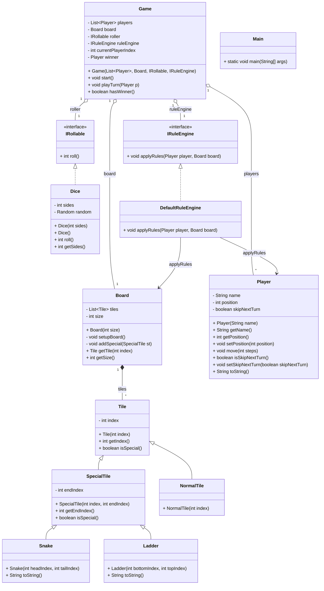

Here’s a **ready-to-use `README.md`** you can drop directly into the root of your **snakes\_ladders** project.
It includes build/run instructions, project notes, and the Mermaid UML diagram.

```markdown
# Snakes & Ladders – Java (Console)

A simple console implementation of the classic **Snakes & Ladders** game.

---

## 📂 Project Structure
```

snakes\_ladders/
├─ src/main/java/com/snakesladders/   # Java source files
└─ README.md

````

---

## 🛠️ Build & Run

From the project root (`snakes_ladders`):

### Compile
```bash
javac -d out $(find . -name "*.java")
````

### Run

```bash
java -cp out com.snakesladders.Main
```

---

## 🎮 Game Rules & Notes

* Uses a default board with preset snakes and ladders.
* **Overshoot rule**: if a roll would move past the final tile, the player stays in place.

---

## 🧩 UML Class Diagram

Below is a Mermaid UML class diagram that mirrors the Java source.
GitHub renders Mermaid automatically—just view this README in the repo.



---
