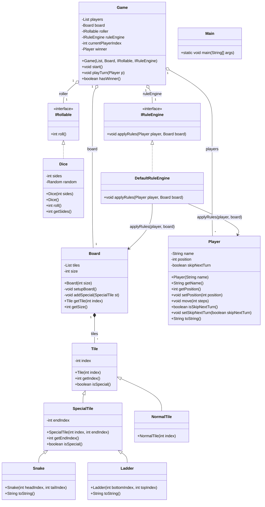

Snakes and Ladders - Java

Simple console implementation of Snakes and Ladders.

Structure:
- src/main/java/com/snakesladders - Java sources

How to build/run (from project root `snakes_ladders`):

Compile:

javac -d out $(find . -name "*.java")

Run:

java -cp out com.snakesladders.Main

Notes:
- Uses a default board with some preset snakes/ladders.
- Overshoot rule: if a roll would move past the last tile, the player stays in place.

UML Class Diagram (PlantUML)

Below is a PlantUML diagram that mirrors the Java source in `src/main/java/com/snakesladders`.
You can render it with PlantUML (paste into https://plantuml.com/ or use a local PlantUML tool).

Notes and assumptions:
- The diagram lists visible fields and public methods present in the source.
- Constructors and toString methods are included for clarity.
- The `Board.tiles` collection is shown as a composition to Tile instances (1..*).
- PlantUML rendering requires a PlantUML renderer or the web editor at https://plantuml.com/.

